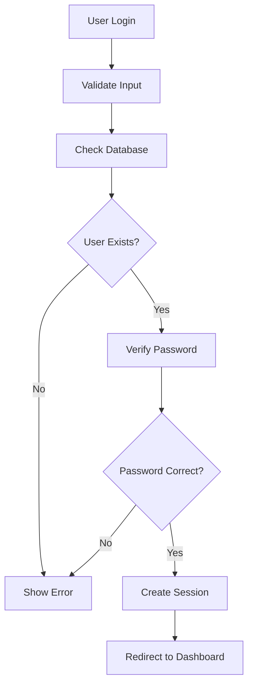

# Menteego - Technical Documentation

## 📚 Table of Contents

1. [System Architecture](#system-architecture)
2. [Database Design](#database-design)
3. [Authentication System](#authentication-system)
4. [Mentorship Logic](#mentorship-logic)
5. [Messaging System](#messaging-system)
6. [Resource Sharing](#resource-sharing)
7. [API Endpoints](#api-endpoints)
8. [Security Implementation](#security-implementation)
9. [Frontend Architecture](#frontend-architecture)
10. [Error Handling](#error-handling)
11. [Performance Optimizations](#performance-optimizations)

## 🏗 System Architecture

### Overview
Menteego follows a **Model-View-Controller (MVC)** pattern with PHP as the backend language and MySQL as the database. The system is designed with modularity and scalability in mind.

### Architecture Components

```
┌─────────────────┐    ┌─────────────────┐    ┌─────────────────┐
│   Frontend      │    │   Backend       │    │   Database      │
│   (HTML/CSS/JS) │◄──►│   (PHP)         │◄──►│   (MySQL)       │
└─────────────────┘    └─────────────────┘    └─────────────────┘
         │                       │                       │
         │                       │                       │
    ┌─────────┐           ┌─────────┐           ┌─────────┐
    │Bootstrap│           │Session  │           │Users    │
    │FontAwesome│         │Management│           │Mentorships│
    │AJAX     │           │PDO      │           │Messages │
    └─────────┘           └─────────┘           └─────────┘
```

### Technology Stack Details

**Backend Technologies:**
- **PHP 8.0+**: Server-side scripting with object-oriented programming
- **PDO**: Database abstraction layer for secure connections
- **Session Management**: User state management and authentication
- **File System**: Secure file upload and storage

**Frontend Technologies:**
- **HTML5**: Semantic markup structure
- **CSS3**: Responsive styling with Bootstrap framework
- **JavaScript (ES6+)**: Client-side interactivity and AJAX
- **Bootstrap 5.3**: Responsive UI components
- **Font Awesome**: Icon library for enhanced UX

**Database:**
- **MySQL**: Relational database management system
- **InnoDB Engine**: ACID compliance and transaction support
- **Indexing**: Optimized query performance

## 🗄 Database Design

### Database Schema Overview

The database is designed with **normalization principles** to ensure data integrity and eliminate redundancy.

### Core Tables

#### 1. `users` Table
```sql
CREATE TABLE users (
    id INT PRIMARY KEY AUTO_INCREMENT,
    first_name VARCHAR(50) NOT NULL,
    last_name VARCHAR(50) NOT NULL,
    email VARCHAR(100) UNIQUE NOT NULL,
    password VARCHAR(255) NOT NULL,
    user_role ENUM('mentor', 'mentee') NOT NULL,
    department VARCHAR(100),
    year_of_study VARCHAR(20),
    profile_image VARCHAR(255),
    bio TEXT,
    created_at TIMESTAMP DEFAULT CURRENT_TIMESTAMP,
    updated_at TIMESTAMP DEFAULT CURRENT_TIMESTAMP ON UPDATE CURRENT_TIMESTAMP
);
```

**Purpose**: Stores user account information and profiles
**Key Features**:
- Unique email constraint
- Role-based access control
- Profile image support
- Timestamp tracking

#### 2. `mentorships` Table
```sql
CREATE TABLE mentorships (
    id INT PRIMARY KEY AUTO_INCREMENT,
    mentor_id INT NOT NULL,
    mentee_id INT NOT NULL,
    status ENUM('active', 'completed', 'terminated') DEFAULT 'active',
    start_date DATE,
    end_date DATE,
    created_at TIMESTAMP DEFAULT CURRENT_TIMESTAMP,
    FOREIGN KEY (mentor_id) REFERENCES users(id),
    FOREIGN KEY (mentee_id) REFERENCES users(id)
);
```

**Purpose**: Manages active mentorship relationships
**Key Features**:
- Foreign key constraints for data integrity
- Status tracking for relationship lifecycle
- Date tracking for mentorship duration

#### 3. `mentorship_requests` Table
```sql
CREATE TABLE mentorship_requests (
    id INT PRIMARY KEY AUTO_INCREMENT,
    mentee_id INT NOT NULL,
    mentor_id INT NOT NULL,
    status ENUM('pending', 'accepted', 'rejected') DEFAULT 'pending',
    message TEXT,
    duration_weeks INT,
    preferred_meeting_type ENUM('in_person', 'virtual', 'hybrid'),
    created_at TIMESTAMP DEFAULT CURRENT_TIMESTAMP,
    FOREIGN KEY (mentee_id) REFERENCES users(id),
    FOREIGN KEY (mentor_id) REFERENCES users(id)
);
```

**Purpose**: Handles mentorship request workflow
**Key Features**:
- Request lifecycle management
- Custom message support
- Meeting preference tracking

#### 4. `messages` Table
```sql
CREATE TABLE messages (
    id INT PRIMARY KEY AUTO_INCREMENT,
    mentorship_id INT NOT NULL,
    sender_id INT NOT NULL,
    receiver_id INT NOT NULL,
    message TEXT NOT NULL,
    is_read BOOLEAN DEFAULT FALSE,
    created_at TIMESTAMP DEFAULT CURRENT_TIMESTAMP,
    updated_at TIMESTAMP DEFAULT CURRENT_TIMESTAMP ON UPDATE CURRENT_TIMESTAMP,
    FOREIGN KEY (mentorship_id) REFERENCES mentorships(id),
    FOREIGN KEY (sender_id) REFERENCES users(id),
    FOREIGN KEY (receiver_id) REFERENCES users(id)
);
```

**Purpose**: Stores chat messages and shared resources
**Key Features**:
- Message threading by mentorship
- Read status tracking
- Timestamp management

#### 5. `notifications` Table
```sql
CREATE TABLE notifications (
    id INT PRIMARY KEY AUTO_INCREMENT,
    user_id INT NOT NULL,
    title VARCHAR(255) NOT NULL,
    message TEXT NOT NULL,
    type ENUM('info', 'success', 'warning', 'error') DEFAULT 'info',
    is_read BOOLEAN DEFAULT FALSE,
    created_at TIMESTAMP DEFAULT CURRENT_TIMESTAMP,
    FOREIGN KEY (user_id) REFERENCES users(id)
);
```

**Purpose**: System notifications and alerts
**Key Features**:
- User-specific notifications
- Type categorization
- Read status tracking

### Database Relationships

```
users (1) ──── (many) mentorship_requests
users (1) ──── (many) mentorships (as mentor)
users (1) ──── (many) mentorships (as mentee)
mentorships (1) ──── (many) messages
users (1) ──── (many) messages (as sender)
users (1) ──── (many) messages (as receiver)
users (1) ──── (many) notifications
```

### Indexing Strategy

**Primary Indexes:**
- `users.email` - For login lookups
- `mentorship_requests.mentor_id` - For request filtering
- `messages.mentorship_id` - For conversation loading
- `messages.created_at` - For chronological ordering

**Composite Indexes:**
- `(mentor_id, status)` on mentorship_requests
- `(mentorship_id, created_at)` on messages

## 🔐 Authentication System

### Session Management

**Session Configuration:**
```php
// Start session with secure settings
session_start();
ini_set('session.cookie_httponly', 1);
ini_set('session.cookie_secure', 1);
ini_set('session.use_strict_mode', 1);
```

**Session Security Features:**
- HTTP-only cookies prevent XSS attacks
- Secure cookies for HTTPS environments
- Strict mode prevents session fixation
- Automatic session timeout

### Password Security

**Hashing Implementation:**
```php
// Password hashing using password_hash()
$hashedPassword = password_hash($password, PASSWORD_DEFAULT);

// Password verification
if (password_verify($inputPassword, $storedHash)) {
    // Login successful
}
```

**Security Features:**
- Bcrypt algorithm with salt
- Cost factor of 12 (default)
- Automatic salt generation
- Timing attack protection

### Authentication Flow



### Role-Based Access Control

**Implementation:**
```php
// Check user role for access control
if (!isset($_SESSION['user_role']) || $_SESSION['user_role'] !== 'mentor') {
    header('Location: /auth/login.php');
    exit();
}
```

**Access Control Levels:**
- **Public**: Login, registration, password reset
- **Mentee**: Browse mentors, send requests, messaging
- **Mentor**: View requests, manage mentorships, messaging
- **Admin**: User management, system oversight

## 👥 Mentorship Logic

### Request Workflow

**Request Creation Process:**
```php
function createMentorshipRequest($menteeId, $mentorId, $message, $duration, $meetingType) {
    // Validate mentor availability
    // Check mentee's existing requests
    // Create request record
    // Send notification to mentor
}
```

**Request States:**
1. **Pending**: Initial state after creation
2. **Accepted**: Mentor approved the request
3. **Rejected**: Mentor declined the request

### Matching Algorithm

**Mentor Discovery Logic:**
```php
function findAvailableMentors($department, $skills, $availability) {
    // Query mentors by department
    // Filter by available capacity
    // Sort by relevance score
    // Return ranked results
}
```

**Relevance Scoring:**
- Department match: 40%
- Skill alignment: 30%
- Availability match: 20%
- Profile completeness: 10%

### Capacity Management

**Mentor Capacity Rules:**
- Maximum 3 active mentees per mentor
- Automatic capacity checking
- Queue management for overflow

**Mentee Restrictions:**
- Only 1 active mentor at a time
- Multiple pending requests allowed
- Automatic request cancellation on acceptance

## 💬 Messaging System

### AJAX Implementation

**Message Sending Flow:**
```javascript
async function sendMessage(message, mentorshipId) {
    try {
        const response = await fetch('/api/messages/send-message.php', {
            method: 'POST',
            headers: {
                'Content-Type': 'application/json',
                'Accept': 'application/json'
            },
            body: JSON.stringify({
                message_content: message,
                mentorship_id: mentorshipId
            })
        });
        
        const result = await response.json();
        if (result.success) {
            // Handle success
        } else {
            // Handle error
        }
    } catch (error) {
        // Handle network error
    }
}
```

### Real-Time Features

**Auto-Scroll Implementation:**
```javascript
function scrollToBottom() {
    const chatMessages = document.getElementById('chatMessages');
    if (chatMessages) {
        chatMessages.scrollTop = chatMessages.scrollHeight;
    }
}
```

**Message Display Logic:**
```php
// Check if message is a resource
if (strpos($message['message'], 'uploads/resources/') !== false) {
    // Display as resource with download link
    echo '<div class="resource-item" onclick="downloadResource(...)">';
} else {
    // Display as regular text message
    echo nl2br(htmlspecialchars($message['message']));
}
```

### Conversation Management

**Message Retrieval:**
```php
function getMentorshipMessages($mentorshipId, $userId) {
    $query = "SELECT m.*, u.first_name, u.last_name, u.profile_image
              FROM messages m
              JOIN users u ON m.sender_id = u.id
              WHERE m.mentorship_id = ?
              ORDER BY m.created_at ASC";
}
```

**Read Status Tracking:**
```php
function markMessagesAsRead($mentorshipId, $userId) {
    $query = "UPDATE messages SET is_read = 1 
              WHERE mentorship_id = ? AND receiver_id = ? AND is_read = 0";
}
```

## 📁 Resource Sharing

### File Upload System

**Upload Configuration:**
```php
// File upload settings
$maxFileSize = 10 * 1024 * 1024; // 10MB
$allowedTypes = ['pdf', 'doc', 'docx', 'jpg', 'png', 'txt'];
$uploadDir = 'uploads/resources/';
```

**Security Measures:**
- File type validation
- Size limit enforcement
- Unique filename generation
- Secure file storage

### File Processing

**Upload Handler:**
```php
function processFileUpload($file, $mentorshipId) {
    // Validate file
    if (!validateFile($file)) {
        return false;
    }
    
    // Generate unique filename
    $uniqueName = generateUniqueFilename($file['name']);
    
    // Move file to secure location
    if (move_uploaded_file($file['tmp_name'], $uploadDir . $uniqueName)) {
        // Create message record
        return createResourceMessage($mentorshipId, $uniqueName);
    }
    
    return false;
}
```

**Download Implementation:**
```javascript
function downloadResource(filePath, fileName) {
    const link = document.createElement('a');
    link.href = filePath;
    link.download = fileName;
    link.target = '_blank';
    document.body.appendChild(link);
    link.click();
    document.body.removeChild(link);
}
```

## 🔧 API Endpoints

### Authentication Endpoints

**Login API:**
```php
// POST /auth/login.php
{
    "email": "user@example.com",
    "password": "securepassword"
}

Response:
{
    "success": true,
    "message": "Login successful",
    "user": {
        "id": 1,
        "name": "John Doe",
        "role": "mentor"
    }
}
```

**Registration API:**
```php
// POST /auth/register.php
{
    "first_name": "John",
    "last_name": "Doe",
    "email": "john@example.com",
    "password": "securepassword",
    "user_role": "mentor",
    "department": "Computer Science"
}
```

### Mentorship Endpoints

**Respond to Request API:**
```php
// POST /api/mentor/respond-request.php
{
    "request_id": 123,
    "action": "accepted" // or "rejected"
}

Response:
{
    "success": true,
    "message": "Request accepted successfully"
}
```

### Messaging Endpoints

**Send Message API:**
```php
// POST /api/messages/send-message.php
{
    "message_content": "Hello! How are you?",
    "mentorship_id": 456
}

Response:
{
    "success": true,
    "message": "Message sent successfully",
    "data": {
        "message_id": 789,
        "created_at": "2024-01-15 10:30:00"
    }
}
```

**Share Resource API:**
```php
// POST /api/messages/send-resource.php
// Multipart form data
{
    "mentorship_id": 456,
    "files[]": [file1, file2, ...]
}

Response:
{
    "success": true,
    "message": "Resources shared successfully",
    "data": {
        "files_uploaded": 2
    }
}
```

## 🛡 Security Implementation

### SQL Injection Prevention

**Prepared Statements:**
```php
// Secure database queries
$stmt = $pdo->prepare("SELECT * FROM users WHERE email = ? AND status = ?");
$stmt->execute([$email, 'active']);
$user = $stmt->fetch(PDO::FETCH_ASSOC);
```

**Parameter Binding:**
- All user inputs are bound as parameters
- No direct string concatenation in queries
- Type-safe parameter handling

### XSS Protection

**Output Escaping:**
```php
// HTML escaping for user content
echo htmlspecialchars($userInput, ENT_QUOTES, 'UTF-8');

// For display in HTML
echo nl2br(htmlspecialchars($messageContent));
```

**Content Security:**
- Input validation on server-side
- Output encoding for all dynamic content
- Sanitization of file uploads

### CSRF Protection

**Token Implementation:**
```php
// Generate CSRF token
$_SESSION['csrf_token'] = bin2hex(random_bytes(32));

// Validate token in forms
if (!hash_equals($_SESSION['csrf_token'], $_POST['csrf_token'])) {
    die('CSRF token validation failed');
}
```

### File Upload Security

**Validation Chain:**
```php
function validateUploadedFile($file) {
    // Check file size
    if ($file['size'] > $maxFileSize) {
        return false;
    }
    
    // Check file type
    $extension = strtolower(pathinfo($file['name'], PATHINFO_EXTENSION));
    if (!in_array($extension, $allowedTypes)) {
        return false;
    }
    
    // Check for malicious content
    if (containsMaliciousContent($file['tmp_name'])) {
        return false;
    }
    
    return true;
}
```

## 🎨 Frontend Architecture

### Component Structure

**Bootstrap Integration:**
```html
<!-- Responsive navigation -->
<nav class="navbar navbar-expand-lg navbar-dark bg-primary">
    <div class="container">
        <a class="navbar-brand" href="/">Menteego</a>
        <div class="collapse navbar-collapse">
            <!-- Navigation items -->
        </div>
    </div>
</nav>
```

**Card-Based Layout:**
```html
<div class="card shadow-sm">
    <div class="card-header">
        <h6 class="card-title">Conversations</h6>
    </div>
    <div class="card-body">
        <!-- Content -->
    </div>
</div>
```

### JavaScript Architecture

**Module Pattern:**
```javascript
// Message handling module
const MessageHandler = {
    sendMessage: async function(message, mentorshipId) {
        // Implementation
    },
    
    loadMessages: async function(mentorshipId) {
        // Implementation
    },
    
    markAsRead: function(messageId) {
        // Implementation
    }
};
```

**Event Handling:**
```javascript
// Form submission with AJAX
document.getElementById('messageForm').addEventListener('submit', async function(e) {
    e.preventDefault();
    // Handle form submission
});
```

### Responsive Design

**Bootstrap Grid System:**
```html
<div class="row">
    <div class="col-lg-4">
        <!-- Conversations list -->
    </div>
    <div class="col-lg-8">
        <!-- Chat area -->
    </div>
</div>
```

**Mobile-First Approach:**
- Responsive breakpoints
- Touch-friendly interfaces
- Optimized for small screens

## ⚠ Error Handling

### Error Classification

**System Errors:**
- Database connection failures
- File system errors
- Memory exhaustion

**User Errors:**
- Invalid input data
- Authentication failures
- Permission violations

**Network Errors:**
- AJAX request failures
- Timeout issues
- Connection problems

### Error Handling Strategy

**Graceful Degradation:**
```php
try {
    $result = performDatabaseOperation();
} catch (PDOException $e) {
    error_log("Database error: " . $e->getMessage());
    showUserFriendlyError("Service temporarily unavailable");
}
```

**User-Friendly Messages:**
```php
function showUserFriendlyError($technicalError) {
    switch ($technicalError) {
        case 'database_connection':
            return "We're experiencing technical difficulties. Please try again later.";
        case 'invalid_input':
            return "Please check your input and try again.";
        default:
            return "Something went wrong. Please try again.";
    }
}
```

**Error Logging:**
```php
// Comprehensive error logging
error_log("Error in " . __FILE__ . " at line " . __LINE__ . ": " . $e->getMessage());
```

## 🚀 Performance Optimizations

### Database Optimizations

**Query Optimization:**
```sql
-- Indexed queries for faster performance
CREATE INDEX idx_messages_mentorship_created ON messages(mentorship_id, created_at);
CREATE INDEX idx_requests_mentor_status ON mentorship_requests(mentor_id, status);
```

**Connection Pooling:**
```php
// Persistent database connections
$pdo = new PDO($dsn, $username, $password, [
    PDO::ATTR_PERSISTENT => true,
    PDO::ATTR_ERRMODE => PDO::ERRMODE_EXCEPTION
]);
```

### Frontend Optimizations

**Asset Optimization:**
- Minified CSS and JavaScript
- Compressed images
- CDN integration for external libraries

**Caching Strategy:**
```php
// Browser caching headers
header('Cache-Control: public, max-age=31536000');
header('Expires: ' . gmdate('D, d M Y H:i:s \G\M\T', time() + 31536000));
```

**Lazy Loading:**
```javascript
// Progressive loading for large datasets
function loadMoreMessages(offset) {
    // Load messages in chunks
}
```

### Memory Management

**Session Cleanup:**
```php
// Automatic session cleanup
ini_set('session.gc_maxlifetime', 3600);
ini_set('session.gc_probability', 1);
ini_set('session.gc_divisor', 100);
```

**File Cleanup:**
```php
// Clean up old temporary files
function cleanupTempFiles() {
    $tempDir = 'uploads/temp/';
    $files = glob($tempDir . '*');
    $now = time();
    
    foreach ($files as $file) {
        if (is_file($file)) {
            if ($now - filemtime($file) >= 86400) { // 24 hours
                unlink($file);
            }
        }
    }
}
```

## 📊 Monitoring and Analytics

### System Monitoring

**Performance Metrics:**
- Database query execution time
- Page load times
- Memory usage
- Error rates

**User Analytics:**
- Active users
- Feature usage
- Session duration
- Conversion rates

### Logging Strategy

**Application Logs:**
```php
// Structured logging
function logActivity($userId, $action, $details) {
    $logEntry = [
        'timestamp' => date('Y-m-d H:i:s'),
        'user_id' => $userId,
        'action' => $action,
        'details' => json_encode($details),
        'ip_address' => $_SERVER['REMOTE_ADDR']
    ];
    
    error_log(json_encode($logEntry));
}
```

**Error Tracking:**
- Comprehensive error logging
- Stack trace capture
- User context information
- Performance impact assessment

---

This technical documentation provides a comprehensive overview of the Menteego mentorship platform's architecture, implementation details, and best practices. It serves as a reference for developers, system administrators, and stakeholders involved in the project.